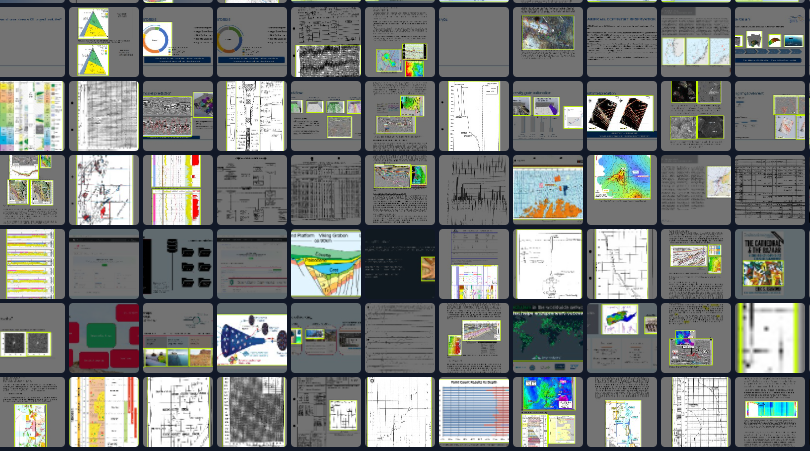

# extract-and-classify-images-from-geoscience-documents
## Geoscience document layout for figures and figure classification in 48 geoscience image categories

In this repro you can find the code to extract geoscience figures from typical oil and gas well reports and other typical oil and gas documents like conference papers or relinquishment reports

Additionally we provide a pretrained tensorflow Resnet50 V2 model trained on Microsoft LOBE https://www.lobe.ai/ for the classification of the extracted geoscience figures. The figure classifier has been trained on 40.0000 publicly available geoscience images extracted from a variety of data soruces. 48 image categories that cover exploration and production geoscience have been labeled and trained on. This model is a good starting point to build your own more refined figure classifier.   These are the categories    (*_
3d_block_diagram
3d_display
background_logos
backgrounds
basin_mod_burial_curve
basin_mod_chromatogram
basin_mod_maturity_depth
basin_mod_van_krevelen_diagram
core_description_log
core_images
cuttings images
cuttings images uv
geosection
graph_fault_seal
graph_histogram
graph_plot_xy
graph_rose_diagram
graph_ternary plot
installations
map_contour
map_culture
map_legend
map_petrol_system
map_risk_crs
map_seismic_attribute
map_seismic_depth
outcrop_images
people_images
seismic_avo_model
seismic_gathers
seismic_inversion
seismic_lines
seismic_polarity
seismic_synthethic_seismogram
seismic_wedge_model
seismic_with_well
stratigraphic_table
table_classic
thin_section_sem_images
thin_section_through_light
volumetrics_decision_tree
volumetrics_geox_graphs
volumetrics_geox_tornado_diagram
well_log
well_log_correlation
well_log_fmi_images
well_pressure_prediction
well_schematic)_*
  

The training images for the yolov5s DLA (document layout) model can be freely downloaded and be used at https://universe.roboflow.com/peter-j1jzx/findthe-images. You can also export the images cropped to the bounding boxes and use this for classification rather than segmentation
  

